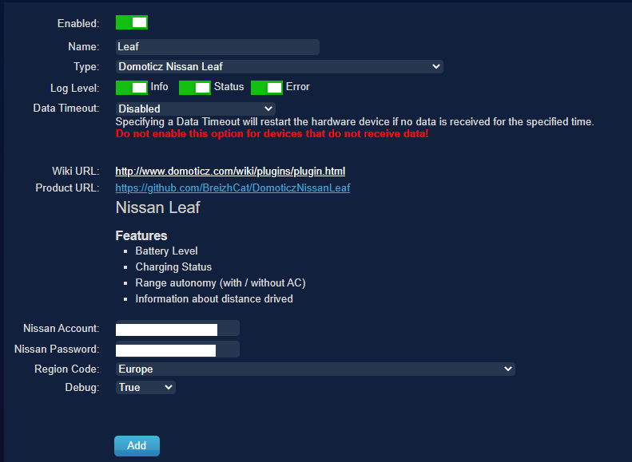
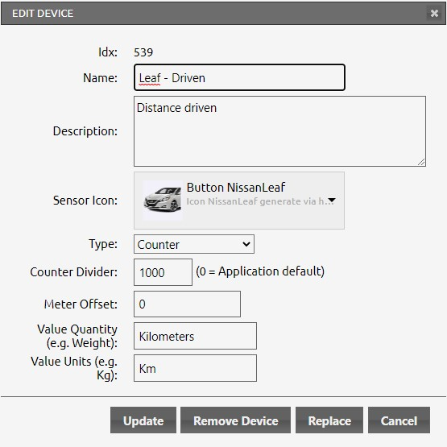

# Domoticz Nissan Leaf Informations

[ ](https://domoticz.com) [](https://www.python.org/)

Ce module permet de suivre l'état de la voiture (chargement, batterie et autonomie) et de voir les distances parcourues chaque jour.

Je m'appuie sur le paquet [LeafPy](https://github.com/nricklin/leafpy) mais il faut prendre en compte la [pull request #100](https://github.com/nricklin/leafpy/pull/100) pour l'Europe. 

Puisque cette dernière n'a pas encore été acceptée, le code  est dupliqué dans le fichier `plugin.py` et il n'est pas nécessaire de cloner ce repo.

Merci à [nricklin](https://github.com/nricklin) pour son travail.

## Installation
Pour installer le module, il suffit de cloner ce dernier dans le sous-dossier plugins de Domoticz :

```shell
git clone https://github.com/BreizhCat/DomoticzNissanLeaf.git
```
Pour la mise à jour :
```shell
git pull
```

Pensez à redémarrer le serveur après l'installation et/ou la mise à jour.

## Configuration

À l'installation, il faut renseigner l'adresse mail et le mot de passe de votre compte [Nissan You+Nissan](https://www.nissan.fr/services/you-plus.html) . 
Il faut ensuite choisir la région (Europe pour mon cas).



Une fois l'hardware créé un ensemble de 6 devices sera ajouté à votre Domoticz.
1. Niveau de batterie (en %)
1. Autonomie sans l'air conditionné (en km)
1. Autonomie avec l'air conditionné (en km)
1. Le nombre de kilomètre parcourus
1. L'état de charge (branché ou non)
1. Un switch pour forcer la mise à jour des données
1. Température de l'habitacle


:warning: Je n'ai pas trouvé comment mettre le ratio à 1000 pour le device Driven. 
Il faut donc l'éditer et mettre 1000 dans la zone `Counter Divider`.


## Chargement historique

Si comme moi, vous avez déjà récupéré un historique des déplacements en utilisant le package Leafpy, vous avez peut être un historique à charger une fois le module installé dans Domoticz.
J'ai fait le script `upload_history` afin de réaliser cela.

```
$> python upload_history -h
usage: Domoticz Leaf Upload History [-h] -f FILE -s SERVER -d DEVICE

optional arguments:
  -h, --help            show this help message and exit

Arguments:
  -f FILE, --file FILE
  -s SERVER, --server SERVER
  -d DEVICE, --device DEVICE

$> python upload_history -f histo_052021.json -s localhost:9888 -d 14
2021-05-03 : 2018 m [Server Code: 200]
2021-05-04 : 2496 m [Server Code: 200]
2021-05-05 : 2824 m [Server Code: 200]
```
